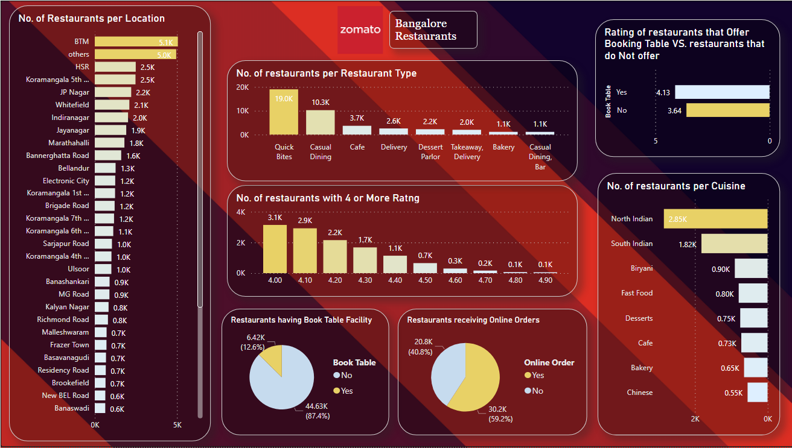

# ZomatoRestaurants - Data Cleaning, EDA and Dashboard

This project includes Data Cleaning, Exploratory Data Analysis and Visualization of a data set of "Zomato Restaurants in Bangalore". (Using Python, Excel and PowerBI)

- *Collecting Data* - of Zomato Restaurants in Bangalore from Kaggle.
- *Cleaning the Data* - using *Python* libraries like Pandas and Numpy (removing/replacing Null values, Dropping unnecessary columns, Renaming Columns to make sense to the reader, Categorising values in columns by creating *Python Functions*)
- *Exploratory Data Analysis (EDA)* - 
    - Finding correlations between different factors affecting restaurants rating.
    - Building Charts and Plots for analysis using *Seaborn and Matplotlib* libraries.
- *Building a Dashboard* - using *PowerBI* to showcase the analysis.

## Dashboard

